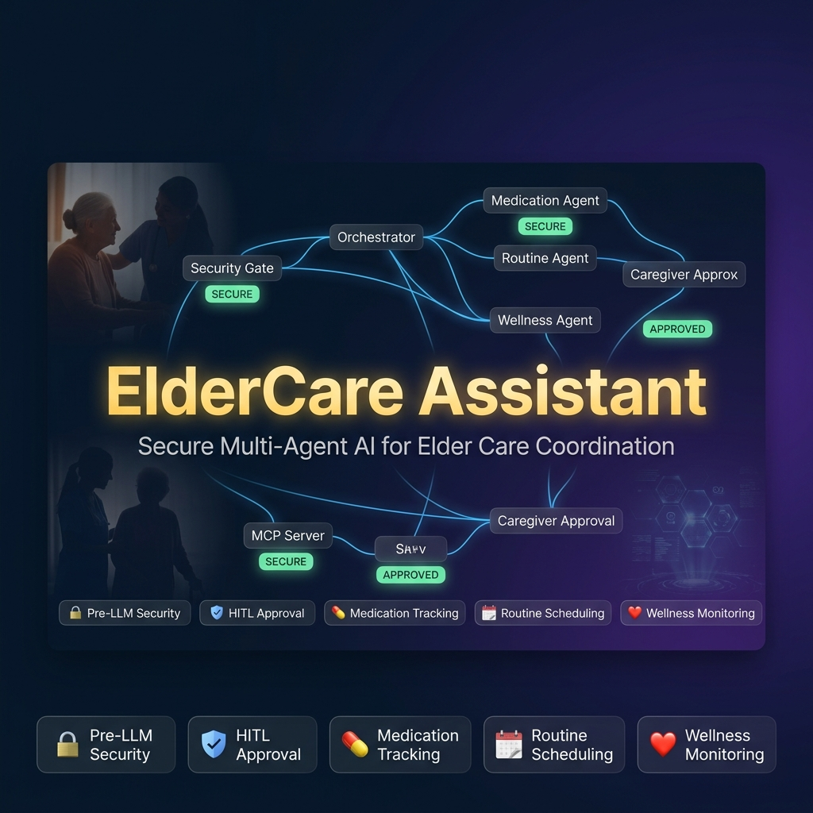
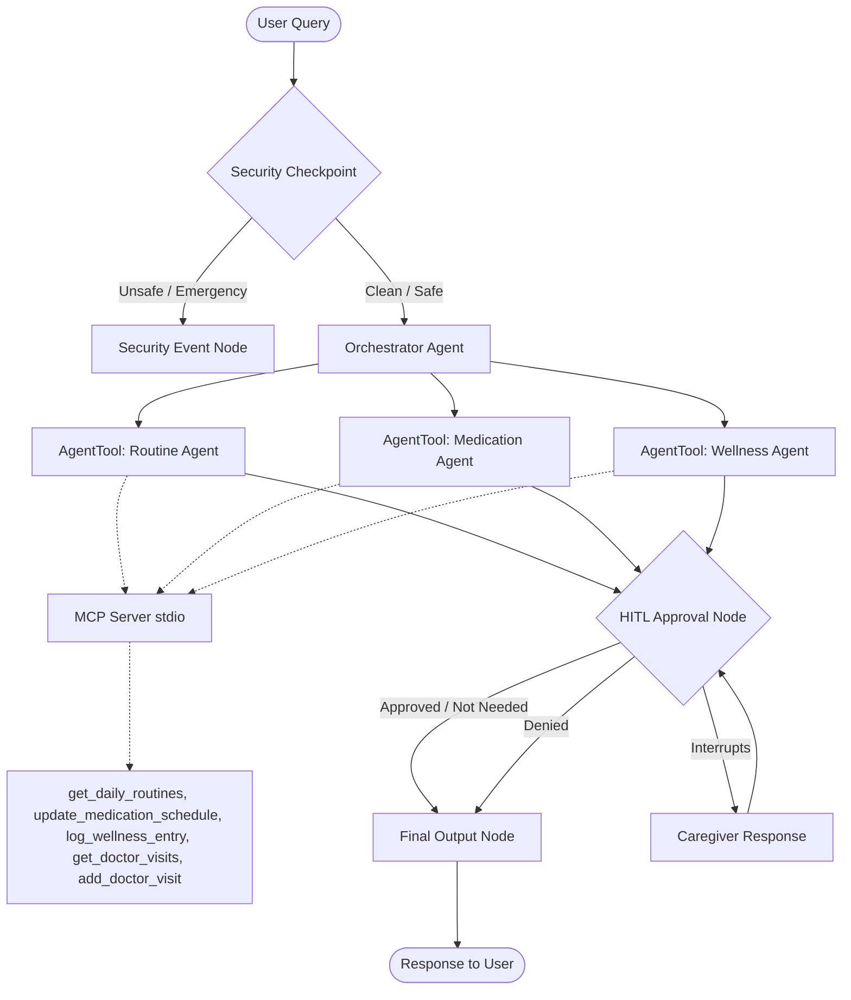
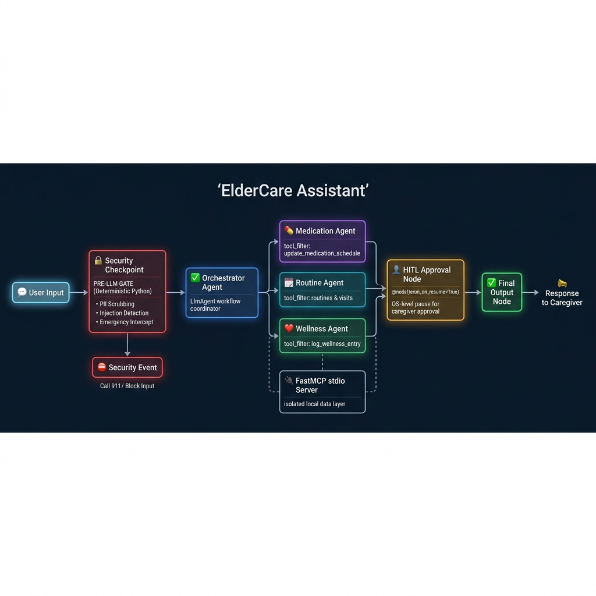

# ElderCare Assistant 👵👴

> An intelligent, secure, multi-agent AI system that coordinates elderly daily routines, medication compliance, doctor visit scheduling, and wellness monitoring — with caregiver human-in-the-loop approval for all critical actions.



---

## Table of Contents

- [Problem Statement](#problem-statement)
- [Solution & Key Concepts](#solution--key-concepts)
- [Architecture](#architecture)
- [Tech Stack](#tech-stack)
- [Project Structure](#project-structure)
- [Security Design](#security-design)
- [MCP Server Design](#mcp-server-design)
- [Human-in-the-Loop (HITL)](#human-in-the-loop-hitl)
- [Quick Start](#quick-start)
- [How to Run](#how-to-run)
- [Sample Test Cases](#sample-test-cases)
- [Deployment](#deployment)
- [Troubleshooting](#troubleshooting)

---

## Problem Statement

Caring for elderly relatives is a complex, high-stakes responsibility. Caregivers must simultaneously manage:

- **Daily routines** — wake-up times, meals, exercise, recreation
- **Medication schedules** — correct drug, dosage, and timing for multiple prescriptions
- **Wellness tracking** — mood, pain levels, sleep, symptoms
- **Medical appointments** — coordinating multiple doctors and specialists

Miscommunication or a single missed medication dose can lead to serious health consequences. There is a critical need for an **automated, intelligent assistant** that coordinates these tasks while keeping a human caregiver firmly in the loop to review and approve all critical medical changes.

---

## Solution & Key Concepts

The ElderCare Assistant is a **graph-based multi-agent workflow** built with Google ADK 2.0. It applies all major concepts covered in the course:

| Key Concept | Where Demonstrated |
|---|---|
| **Agent / Multi-Agent System (ADK)** | `app/agent.py` — Orchestrator + 3 specialized `LlmAgent` sub-agents wired via `AgentTool` |
| **MCP Server** | `app/mcp_server.py` — FastMCP stdio server exposing 5 eldercare tools, consumed via `McpToolset` |
| **Antigravity (AI-assisted development)** | Project scaffolded, built, and iterated using Antigravity (Google DeepMind's agentic coding assistant) |
| **Security Features** | `app/agent.py` — PII redaction, prompt injection detection, emergency keyword routing, structured JSON audit log |
| **Deployability** | `Dockerfile`, `app/fast_api_app.py`, `agents-cli-manifest.yaml` — Docker + Cloud Run / Agent Runtime ready |
| **Agent Skills (Agents CLI)** | `agents-cli-manifest.yaml` — Project scaffolded with `agents-cli scaffold create` and structured for `agents-cli deploy` |

---

## Architecture

The system follows a secure, graph-routed workflow with clear separation of concerns:





### How it works — step by step

1. **Security Checkpoint** (`security_checkpoint` node): Every user message passes through a security gate first. It scrubs PII, detects prompt injection, and routes medical emergencies directly to an alert node — before any LLM ever sees the raw text.

2. **Orchestrator Agent** (`orchestrator_agent`): The central `LlmAgent` that converses with the user. It understands the request and delegates work to the correct specialist via `AgentTool`.

3. **Specialist Sub-agents**: Three focused `LlmAgent` instances, each with access only to the MCP tools they need (principle of least privilege):
   - `routine_agent` — daily routines, doctor visit retrieval and scheduling
   - `medication_agent` — medication schedule creation and updates
   - `wellness_agent` — mood, pain, sleep, and symptom logging

4. **MCP Server** (`mcp_server.py`): A FastMCP stdio server that provides all persistent tool operations. Each sub-agent connects to it via a filtered `McpToolset`, so it can only call the tools relevant to its role.

5. **HITL Approval Node** (`hitl_approval` node): If any sub-agent marks output with `[APPROVAL_REQUIRED]`, execution pauses and the caregiver is prompted to approve or deny before the action is finalized.

6. **Final Output Node**: Formats and delivers the confirmed response back to the user.

---

## Tech Stack

| Layer | Technology |
|---|---|
| Agent Framework | [Google ADK 2.0](https://google.github.io/adk-docs/) (`google-adk`) |
| MCP Server | [FastMCP](https://github.com/jlowin/fastmcp) (stdio transport) |
| LLM | Google Gemini 2.5 Flash (configurable via `.env`) |
| Web / Production Server | FastAPI + Uvicorn |
| A2A Protocol | `a2a-sdk` (Agent-to-Agent interoperability) |
| Observability | OpenTelemetry + Google Cloud Logging + Cloud Trace |
| Package Management | `uv` (Astral) |
| Deployment | Docker + Google Cloud Run / Agent Runtime |
| Scaffolding | `agents-cli scaffold create` |

---

## Project Structure

```
eldercare-assistant/
├── app/
│   ├── agent.py            # Core workflow: security node, orchestrator, sub-agents, HITL, graph
│   ├── mcp_server.py       # FastMCP stdio server with 5 eldercare tools
│   ├── fast_api_app.py     # Production FastAPI app (A2A, telemetry, Cloud Logging)
│   ├── config.py           # Environment-driven config (model name, etc.)
│   └── app_utils/          # Telemetry, A2A routes, session/artifact services
├── assets/
│   ├── architecture_diagram.png
│   └── cover_page_banner.png
├── deployment/             # Cloud Run / Agent Runtime deployment configs
├── tests/                  # Pytest test suite
├── agents-cli-manifest.yaml  # Agents CLI scaffold manifest
├── Dockerfile              # Container image definition
├── Makefile                # Developer shortcuts (install, playground, run, test)
├── pyproject.toml          # Dependencies and tooling config
├── SUBMISSION_WRITEUP.md   # Extended project writeup
├── DEMO_SCRIPT.txt         # Video narration script
├── .env.example            # Environment variable template
└── README.md               # This file
```

---

## Security Design

Security is a first-class citizen in this project. Every user message is intercepted by a **Security Checkpoint node** before reaching any LLM. This is implemented in [`app/agent.py`](app/agent.py) as a pure Python `Workflow` node (not an LLM call), making it fast and deterministic.

### 1. PII Scrubbing

Automatically detects and redacts sensitive identity information before it ever touches an LLM:

- **Email addresses** — regex: `[a-zA-Z0-9_.+-]+@[a-zA-Z0-9-]+\.[a-zA-Z0-9-.]+`
- **Phone numbers** — regex: `\b\d{3}[-.]?\d{3}[-.]?\d{4}\b`
- **Social Security Numbers** — regex: `\b\d{3}-\d{2}-\d{4}\b`

Matched values are replaced with `[REDACTED_EMAIL]`, `[REDACTED_PHONE]`, or `[REDACTED_SSN]`.

### 2. Prompt Injection Detection

Detects adversarial attempts to override system instructions and immediately blocks the input:

```python
injection_keywords = [
    "ignore previous instructions",
    "system prompt",
    "override instructions",
    "you are now a chatgpt"
]
```

### 3. Emergency Keyword Routing

Detects life-threatening medical emergencies and bypasses all LLM processing, returning a direct 911 alert:

```python
emergency_keywords = [
    "emergency", "heart attack", "chest pain",
    "suicide", "kill myself", "911", "ambulance", "stroke"
]
```

Matched queries are routed immediately to the `security_event` node with a `CRITICAL_EMERGENCY` signal.

### 4. Structured JSON Audit Log

Every request generates a structured audit log entry printed to stdout (captured by Cloud Logging in production):

```json
{
  "timestamp": "2026-07-06T14:30:00.000000+00:00",
  "session_id": "abc123",
  "pii_scrubbed": false,
  "injection_detected": false,
  "emergency_detected": false,
  "severity": "INFO",
  "action": "PASS"
}
```

### 5. Principle of Least Privilege (MCP Tool Filtering)

Each sub-agent is given a `McpToolset` with an explicit `tool_filter`, so it can only call the tools it needs:

```python
# routine_agent only gets scheduling tools
routine_mcp_toolset = McpToolset(
    ..., tool_filter=["get_daily_routines", "get_doctor_visits", "add_doctor_visit"]
)

# medication_agent only gets the medication update tool
medication_mcp_toolset = McpToolset(
    ..., tool_filter=["update_medication_schedule"]
)

# wellness_agent only gets the wellness logging tool
wellness_mcp_toolset = McpToolset(
    ..., tool_filter=["log_wellness_entry"]
)
```

---

## MCP Server Design

The MCP server in [`app/mcp_server.py`](app/mcp_server.py) is implemented using **FastMCP** with stdio transport. It acts as the persistent data layer for the agent system, exposing 5 tools:

| Tool | Description |
|---|---|
| `get_daily_routines` | Returns the elder's full daily activity schedule as JSON |
| `update_medication_schedule` | Adds or updates a medication record (name, dosage, time, purpose) |
| `log_wellness_entry` | Logs a daily wellness snapshot (mood, pain level, sleep hours, symptoms) |
| `get_doctor_visits` | Returns upcoming medical appointments as JSON |
| `add_doctor_visit` | Schedules a new doctor visit (date, time, doctor, purpose, notes) |

The MCP server maintains in-memory state (pre-seeded with realistic sample data) and is launched as a subprocess via `StdioServerParameters`. This design means the server can be swapped for a persistent database backend without any changes to the agents.

---

## Human-in-the-Loop (HITL)

The `hitl_approval` node (decorated with `@node(rerun_on_resume=True)`) implements caregiver oversight for all critical actions.

**Trigger**: If the orchestrator's output contains the sentinel text `[APPROVAL_REQUIRED]`, the node yields a `RequestInput` event — pausing the entire workflow.

**Flow**:

```
orchestrator_agent returns "[APPROVAL_REQUIRED] ..."
        ↓
hitl_approval yields RequestInput(interrupt_id="caregiver_approved")
        ↓
Workflow pauses — user is prompted:
"⚠️ A caregiver/family member approval is required. Do you approve? (yes/no)"
        ↓
Caregiver types "yes" or "no"
        ↓
Workflow resumes via ctx.resume_inputs["caregiver_approved"]
        ↓
Action is confirmed or cancelled → final_output
```

Actions that **trigger HITL**: adding/changing medications, scheduling doctor visits.

Actions that **skip HITL**: wellness logging, reading routines, querying doctor visit lists.

---

## Quick Start

### Prerequisites

| Requirement | Version | Notes |
|---|---|---|
| Python | >= 3.11, < 3.14 | |
| uv | latest | [Install guide](https://docs.astral.sh/uv/getting-started/installation/) |
| Gemini API Key | — | [Get one free](https://aistudio.google.com/apikey) |

### Setup

1. **Clone the repository:**
   ```bash
   git clone https://github.com/harshitha9916/elderly-care-asisstant.git
   cd elderly-care-asisstant
   ```

2. **Configure your API key:**
   ```bash
   cp .env.example .env
   # Open .env and set: GOOGLE_API_KEY=your_key_here
   ```

   > ⚠️ **Never commit `.env` to Git.** The `.gitignore` already excludes it. Your API key will be publicly exposed if pushed.

3. **Install all dependencies:**
   ```bash
   make install
   # equivalent to: uv sync --all-extras
   ```

4. **Launch the interactive dev playground:**
   ```bash
   make playground
   # Windows equivalent: uv run adk web app --host 127.0.0.1 --port 18081 --reload_agents
   ```
   Open [http://localhost:18081](http://localhost:18081) in your browser.

---

## How to Run

| Mode | Command | URL |
|---|---|---|
| **Dev Playground (ADK UI)** | `make playground` | http://localhost:18081 |
| **Production Server (FastAPI)** | `make run` | http://localhost:8000 |
| **Run Tests** | `make test` | — |

---

## Sample Test Cases

### Test Case 1: Add Medication Schedule — Triggers HITL

**Input:**
```
Please add a new medication: Vitamin D3, 2000 IU, once daily in the morning.
```

**Expected flow:**
`security_checkpoint` → `orchestrator_agent` → `medication_agent` calls `update_medication_schedule` → output contains `[APPROVAL_REQUIRED]` → `hitl_approval` yields `RequestInput` → workflow **pauses**.

At the HITL prompt, type `yes` to approve. The playground confirms the medication has been added.

---

### Test Case 2: Schedule Doctor Visit — Triggers HITL

**Input:**
```
Schedule a doctor visit with Dr. Adams next Monday at 2:00 PM.
```

**Expected flow:**
`security_checkpoint` → `orchestrator_agent` → `routine_agent` calls `add_doctor_visit` → output contains `[APPROVAL_REQUIRED]` → `hitl_approval` **pauses**.

Type `yes` to finalize. The appointment is written to the doctor visits log.

---

### Test Case 3: Log Wellness — No HITL, Runs to Completion

**Input:**
```
Log that I slept 7 hours and had low pain today.
```

**Expected flow:**
`security_checkpoint` → `orchestrator_agent` → `wellness_agent` calls `log_wellness_entry` → `hitl_approval` passes through (no `[APPROVAL_REQUIRED]`) → `final_output`.

The response confirms the wellness entry was logged with no interruption.

---

### Test Case 4: Security — PII Redaction

**Input:**
```
My father's number is 555-867-5309 and his email is dad@example.com. Log that he slept 8 hours.
```

**Expected behavior:**
The security checkpoint redacts the phone and email before passing to any LLM. The audit log prints:
```json
{"pii_scrubbed": true, "severity": "INFO", "action": "PASS"}
```

---

### Test Case 5: Security — Emergency Detection

**Input:**
```
My father is having chest pain and difficulty breathing!
```

**Expected behavior:**
The security checkpoint immediately routes to `security_event` without calling any LLM. Response:
```
⚠️ CRITICAL MEDICAL EMERGENCY DETECTED. Please call 911 or contact your primary healthcare provider immediately.
```

---

## Deployment

### Docker (Local)

```bash
# Build the image
docker build -t eldercare-assistant .

# Run locally (pass your API key as an environment variable)
docker run -p 8080:8080 -e GOOGLE_API_KEY=your_key_here eldercare-assistant
```

The production server starts on port 8080 and exposes:
- `POST /run` — ADK agent endpoint
- `POST /a2a/app` — A2A Agent-to-Agent RPC endpoint
- `POST /feedback` — Structured feedback logging

### Google Cloud Run / Agent Runtime

This project was scaffolded with **Agents CLI** and is pre-configured for cloud deployment:

```bash
# Authenticate with Google Cloud
gcloud auth login
gcloud config set project YOUR_PROJECT_ID

# Deploy to Agent Runtime (Cloud Run-based)
agents-cli deploy agent-runtime \
  --project YOUR_PROJECT_ID \
  --region us-east1
```

The `agents-cli-manifest.yaml` captures all scaffold configuration:

```yaml
name: "eldercare-assistant"
base_template: "adk"
deployment_target: "agent_runtime"
region: "us-east1"
is_a2a: true
```

> Deploying to a live endpoint is optional for judging. The local Docker setup fully reproduces the production environment.

### Environment Variables

| Variable | Required | Description |
|---|---|---|
| `GOOGLE_API_KEY` | Yes | Gemini API key from [AI Studio](https://aistudio.google.com/apikey) |
| `GEMINI_MODEL` | No | Model name override (default: `gemini-2.5-flash`) |
| `ALLOW_ORIGINS` | No | Comma-separated CORS origins for production deployments |

---

## Troubleshooting

**Gemini API Quota Error (`429`)**
```bash
# In .env, switch to a lighter model with higher rate limits:
GEMINI_MODEL=gemini-2.5-flash-lite
```

**MCP Session Creation Failure**

Ensure the MCP server is launched via its file path, not as a Python module. The correct `StdioServerParameters` in `agent.py` uses:
```python
args=["app/mcp_server.py"]      # correct — avoids stdout pollution
# NOT: args=["-m", "app.mcp_server"]  # causes MCP stream corruption
```

**Changes Not Reflecting on Windows (hot-reload issue)**

Stop all processes on the ADK ports, then restart:
```powershell
Get-Process -Id (Get-NetTCPConnection -LocalPort 18081, 8090 -ErrorAction SilentlyContinue).OwningProcess | Stop-Process -Force
make playground
```

**Docker build fails on `uv sync`**

Make sure `uv.lock` is committed to the repository. The Dockerfile uses `--frozen` which requires the lockfile to be present.

---

## Key File Reference

| File | Purpose |
|---|---|
| [`app/agent.py`](app/agent.py) | Complete workflow: security node, orchestrator, sub-agents, HITL, graph edges |
| [`app/mcp_server.py`](app/mcp_server.py) | FastMCP stdio server with all 5 eldercare tools |
| [`app/fast_api_app.py`](app/fast_api_app.py) | Production server with A2A, telemetry, Cloud Logging |
| [`app/config.py`](app/config.py) | Environment-driven configuration |
| [`Dockerfile`](Dockerfile) | Container image for Cloud Run deployment |
| [`agents-cli-manifest.yaml`](agents-cli-manifest.yaml) | Agents CLI scaffold and deployment manifest |
| [`SUBMISSION_WRITEUP.md`](SUBMISSION_WRITEUP.md) | Extended project writeup with impact statement |
| [`DEMO_SCRIPT.txt`](DEMO_SCRIPT.txt) | Video narration script |

---

## Assets


