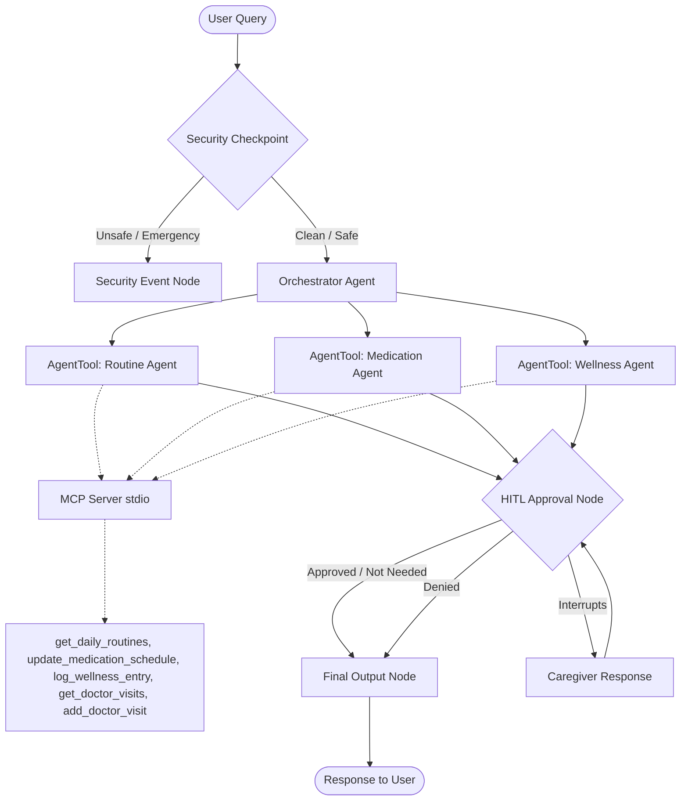

# Project Submission Write-up: ElderCare Assistant 👵👴

**Track:** Concierge Agents
**GitHub:** https://github.com/harshitha9916/elderly-care-asisstant

---

## Problem Statement

Over 53 million Americans serve as unpaid caregivers for elderly relatives. They simultaneously juggle medication schedules, coordinate daily routines, log wellness changes, and schedule appointments — all while managing their own lives. The consequences of failure are severe: missed medications, miscommunicated appointments, and unrecognized wellness decline can cascade into hospitalizations. According to the WHO, medication errors alone harm 1.3 million people annually in the United States.

The core issue is not lack of care — it is the **lack of an intelligent coordination layer** that tracks these moving pieces, raises the right alerts, and ensures a qualified human makes the final call on critical changes.

---

## Why Agents?

A traditional app forces caregivers to navigate menus and fill forms. An agent-based solution is fundamentally different:

- **Natural language understanding** — say _"Add Vitamin D3, 2000 IU, once daily"_ instead of filling a form
- **Intelligent routing** — the orchestrator knows which specialist to engage for each request
- **Automatic safety enforcement** — dangerous inputs are intercepted; irreversible changes require explicit approval
- **Scalable complexity** — multiple specialist agents handle simultaneous concerns while the orchestrator synthesizes a unified response

---

## Solution Architecture

ElderCare Assistant is a graph-based multi-agent workflow built on **Google ADK 2.0**. Every user message flows through a deterministic security gate, then a specialist delegation layer, and finally a caregiver approval checkpoint.



### Key Design Decisions

**Security as a non-LLM node** — The security checkpoint is pure Python, making behavior 100% deterministic and impossible to bypass with adversarial prompting.

**Specialist agents, not one giant agent** — Each sub-agent has a narrow, single-responsibility instruction and accesses only the tools it needs (principle of least privilege).

**MCP as the persistence layer** — All data operations are isolated behind a FastMCP stdio server. The agent logic can be upgraded without touching the data layer.

**HITL as a workflow interrupt** — ADK's `RequestInput` + `@node(rerun_on_resume=True)` pauses the workflow at the OS level. No LLM can "approve" a medication change on the caregiver's behalf.

---

## Course Concepts Applied

| Concept | Implementation |
|---|---|
| **Multi-Agent System (ADK)** | Orchestrator + 3 specialist `LlmAgent` instances wired via `AgentTool` into an ADK 2.0 `Workflow` graph |
| **MCP Server** | FastMCP stdio server in `mcp_server.py` with filtered `McpToolset` per agent (least privilege) |
| **Antigravity** | Entire project — architecture, code, debugging, documentation — built using Antigravity (Google DeepMind's agentic coding assistant) |
| **Security Features** | PII redaction, prompt injection detection, emergency keyword routing, structured JSON audit log — all in a pre-LLM Python node |
| **Deployability** | Dockerfile + FastAPI production server + A2A SDK + Cloud Logging + `agents-cli-manifest.yaml` for Cloud Run / Agent Runtime |
| **Agents CLI** | Scaffolded with `agents-cli scaffold create`; configured for `agents-cli deploy agent-runtime` |

---

## Security Design

### PII Scrubbing
Emails, phone numbers, and SSNs are detected and replaced with redaction tokens before any LLM sees the input. A caregiver mentioning a parent's SSN in context ("needed for this form") cannot accidentally expose it through an LLM response.

### Prompt Injection Guard
Keywords like `"ignore previous instructions"` or `"override instructions"` are detected and the request is immediately blocked with a warning response.

### Emergency Intercept
Keywords like `"chest pain"`, `"stroke"`, `"ambulance"` trigger an immediate 911 guidance response — no LLM call, no delay. In a real emergency, milliseconds matter.

### Structured JSON Audit Log
Every message produces a timestamped, severity-tagged JSON log for compliance:
```json
{
  "timestamp": "2026-07-06T18:45:00Z",
  "session_id": "abc123",
  "pii_scrubbed": true,
  "injection_detected": false,
  "emergency_detected": false,
  "severity": "INFO",
  "action": "PASS"
}
```
In production these flow to Google Cloud Logging, enabling a tamper-evident audit trail.

### Principle of Least Privilege
Each sub-agent's `McpToolset` includes only the tools it needs. `medication_agent` cannot call `add_doctor_visit`; `wellness_agent` cannot touch medications. This is enforced at the toolset layer, not through prompting.

---

## MCP Server Design

`app/mcp_server.py` (FastMCP, stdio transport) exposes five tools:

| Tool | Description |
|---|---|
| `get_daily_routines` | Retrieve daily activity schedule |
| `update_medication_schedule` | Add or update medication records |
| `log_wellness_entry` | Log mood, pain level, sleep hours, symptoms |
| `get_doctor_visits` | Retrieve upcoming appointments |
| `add_doctor_visit` | Schedule a new medical appointment |

Tools are isolated per sub-agent via `tool_filter`, ensuring the data layer enforces domain separation independently of the LLM instructions.

---

## Human-in-the-Loop (HITL)

The `hitl_approval` node uses ADK's `RequestInput` to pause the entire workflow when `[APPROVAL_REQUIRED]` appears in the orchestrator's output:

```
orchestrator_agent → "[APPROVAL_REQUIRED] Add Vitamin D3 2000IU..."
    ↓
hitl_approval fires RequestInput → workflow PAUSES
    ↓
Caregiver prompted: "⚠️ Caregiver approval required. Approve? (yes/no)"
    ↓
Caregiver types "yes" → ctx.resume_inputs["caregiver_approved"]
    ↓
Workflow RESUMES → final_output delivers confirmation
```

HITL-triggering actions: adding/changing medications, scheduling doctor visits.
HITL-exempt actions: wellness logging, reading routines, querying appointments.

---

## Demo Walkthrough

1. **Add Medication** — _"Add Vitamin D3 2000 IU once daily"_ → medication_agent → HITL pause → caregiver approves → committed
2. **Schedule Doctor Visit** — _"Schedule Dr. Adams next Monday 2 PM"_ → routine_agent → HITL pause → caregiver approves → scheduled
3. **Log Wellness** — _"Slept 7 hours, low pain today"_ → wellness_agent → immediate, no HITL
4. **PII Redaction** — _"My dad's number is 555-867-5309..."_ → phone redacted → proceeds safely
5. **Emergency Detection** — _"My father is having chest pain!"_ → immediate 911 alert, no LLM

---

## Impact & Value

**For elderly individuals:** reliable care coordination, privacy protection, immediate emergency escalation.

**For family caregivers:** reduced cognitive burden; interrupted only for decisions that genuinely require human judgment.

**For care agencies:** a structured, auditable care log that could satisfy regulatory requirements.

The global population over 65 will double by 2050. Caregiver burnout is at crisis levels. AI agents that shoulder coordination overhead — while keeping humans in control of decisions that matter — represent a genuine step forward in elder care quality. ElderCare Assistant is not a chatbot. It is a trusted care coordinator that acts as a concierge for families navigating one of life's most demanding challenges.


---

## Solution Architecture
Below is the system architecture of the ElderCare Assistant. It implements a secure check, forwards to a central orchestrator which delegates work to specialized agents using the Model Context Protocol (MCP) server, and integrates a Caregiver Human-in-the-Loop checkpoint before finalizing critical actions.


---

## Concepts Used

- **ADK 2.0 Workflow**: Built using graph-based routing in [agent.py](file:///c:/Users/harsh/OneDrive/Documents/ADK_Workflow/eldercare-assistant/app/agent.py#L225-L235).
- **LlmAgent**: Defines multiple specialized sub-agents (`routine_agent`, `medication_agent`, `wellness_agent`, and `orchestrator_agent`) in [agent.py](file:///c:/Users/harsh/OneDrive/Documents/ADK_Workflow/eldercare-assistant/app/agent.py#L38-L105).
- **AgentTool**: Enables the orchestrator to dynamically delegate queries to the specialist agents in [agent.py](file:///c:/Users/harsh/OneDrive/Documents/ADK_Workflow/eldercare-assistant/app/agent.py#L97-L103).
- **MCP Server**: Implements stdio-based tool interactions for routine and medical logs in [mcp_server.py](file:///c:/Users/harsh/OneDrive/Documents/ADK_Workflow/eldercare-assistant/app/mcp_server.py).
- **Security Checkpoint**: Implements PII scrubbing, prompt injection guards, and structured JSON audit logging in [agent.py](file:///c:/Users/harsh/OneDrive/Documents/ADK_Workflow/eldercare-assistant/app/agent.py#L107-L177).
- **Agents CLI**: Project scaffolded, structured, and run using standard `agents-cli` commands.

---

## Security Design

1. **PII Scrubbing**: Automatically detects and redacts emails, phone numbers, and Social Security Numbers (SSNs) to protect the elder's and caregiver's identity.
2. **Prompt Injection Guard**: Detects adversarial attempts to override the system instructions and immediately blocks the prompt.
3. **Emergency Check**: Detects medical emergencies (e.g., stroke, chest pain) and intercepts the query immediately with emergency guidance (call 911), skipping standard LLM processing.
4. **Structured Audit Log**: Prints structured JSON audit logs for every user message, identifying actions taken and marking them with INFO, WARNING, or CRITICAL severity.

---

## MCP Server Design
The MCP server exposed in [mcp_server.py](file:///c:/Users/harsh/OneDrive/Documents/ADK_Workflow/eldercare-assistant/app/mcp_server.py) provides 5 high-fidelity tools:
- `get_daily_routines`: Lists daily routine schedule.
- `update_medication_schedule`: Adds/updates medication records.
- `log_wellness_entry`: Logs mood, pain level, sleep, and symptoms.
- `get_doctor_visits`: Returns the list of doctor/caregiver appointments.
- `add_doctor_visit`: Schedules doctor visits.

These tools are isolated and wired only to the specialized sub-agents that need them, ensuring strict principle of least privilege.

---

## Human-in-the-Loop (HITL) Flow
To prevent the AI from making unauthorized schedule updates or drug alterations, a Human-in-the-Loop validation is implemented in the `hitl_approval` node. If a sub-agent marks the output with `[APPROVAL_REQUIRED]`, the workflow yields a `RequestInput` which halts execution and prompts the caregiver for approval. It resumes only when a caregiver explicitly replies with `yes` or `no`.

---

## Demo Walkthrough

1. **Test Case 1: Add Medication (HITL)**
   - Query: *"Add medication Vitamin D3 2000 IU"*
   - Flow: `START` ➔ `security_checkpoint` ➔ `orchestrator_agent` ➔ `medication_agent` (calls `update_medication_schedule` tool) ➔ `hitl_approval` (yields `RequestInput` caregiving prompt) ➔ user inputs `yes` ➔ `final_output` (approved).
2. **Test Case 2: Schedule Doctor Visit (HITL)**
   - Query: *"Schedule a doctor visit with Dr. Adams next Monday at 2:00 PM"*
   - Flow: Routes to `routine_agent` which executes the `add_doctor_visit` tool and pauses for caregiver approval. Entering `yes` writes it to the log.
3. **Test Case 3: Daily Wellness Log (No HITL)**
   - Query: *"Log that I slept 7 hours and had low pain today."*
   - Flow: Delegated to `wellness_agent` which runs the `log_wellness_entry` tool and finishes immediately, since no medication/appointment updates require approval.

---

## Impact / Value Statement
ElderCare Assistant gives family members and caregivers peace of mind. It ensures the elder's daily schedule is adhered to and documented, while maintaining a failsafe caregiver-in-the-loop validation for all critical medical schedule updates. This reduces caregiver burnout, prevents medication mistakes, and maintains a secure audit log for professional medical reviews.
